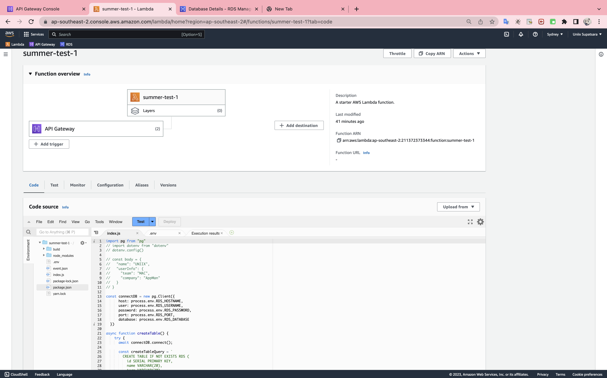
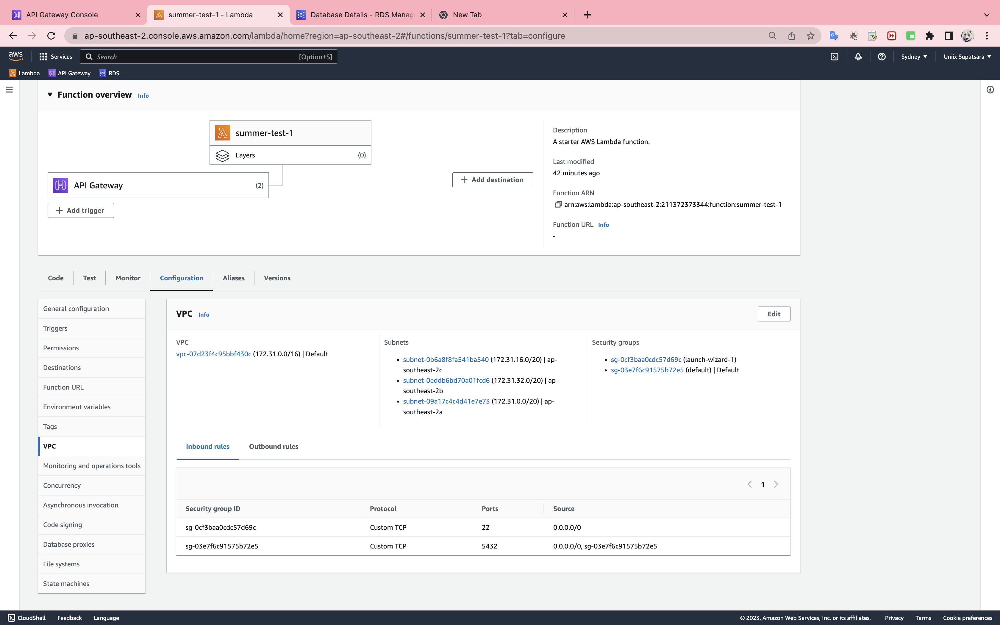
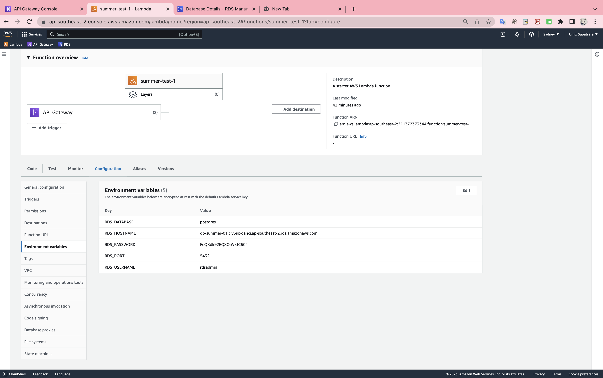
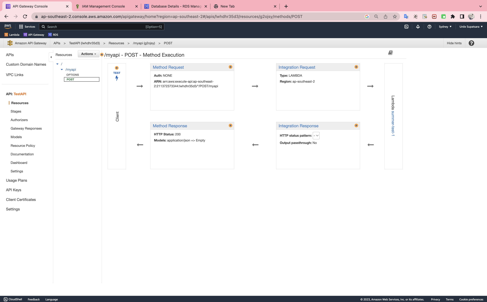
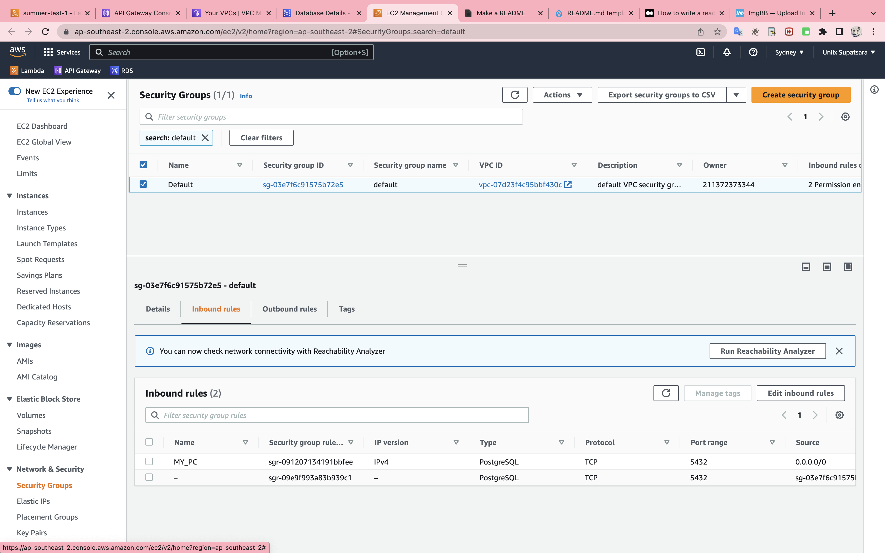
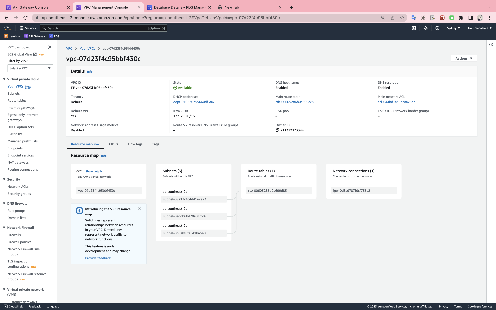
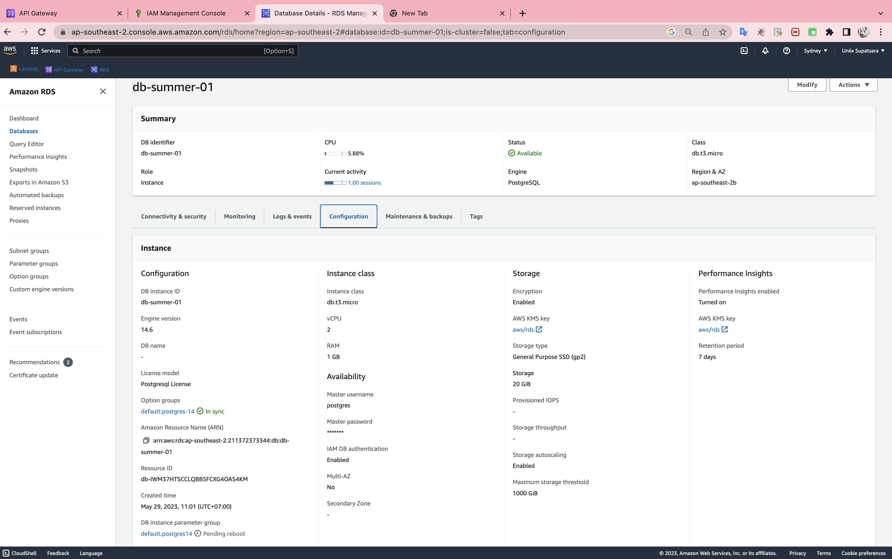

### Create Lambda Function

Write code in index.js to config env and add function create database to and check data base to inserTable

1. Create function name 'summer-test-1'

2. Configuration with VPC (default)

3. Config ENV 
     * RDS_DATABASE
     * RDS_HOSTNAME
     * RDS_PASSWORD
     * RDS_PORT
     * RDS_USERNAME	

4. add triggers API Gateway

### Create API Gateway
* Create resource '/myapi'
* Create method post
* connect to lamdafunction name 'summer-test-1'

### Create Security group rules
* Add Inbound rules setting subnet 0.0.0.0/0 because my pc used this ip to connect DB

### Create RDS

* Create database name 'db-summer-1'
* Add Security group rules to default 
* Add IAM role

